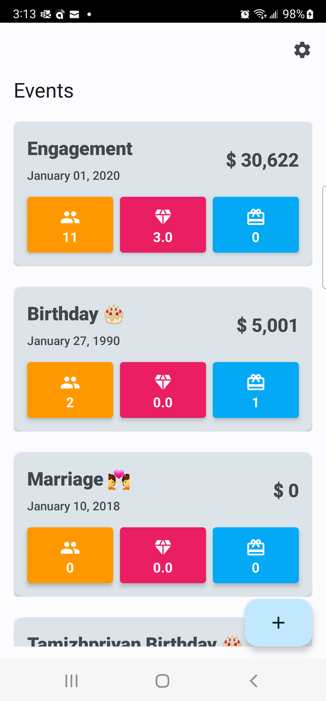
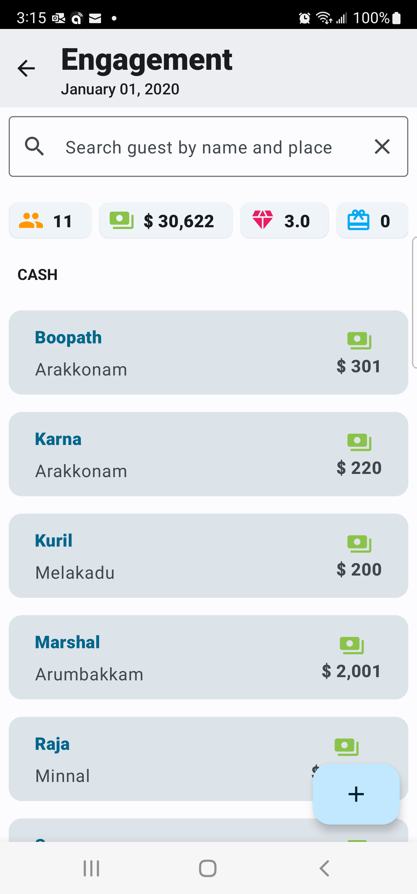
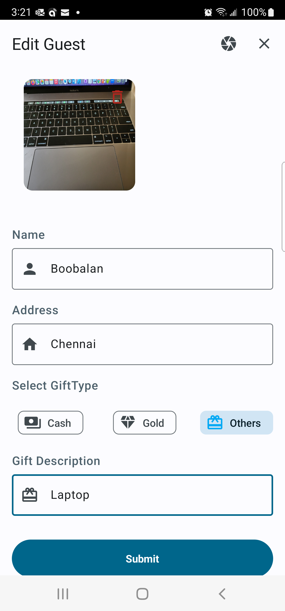
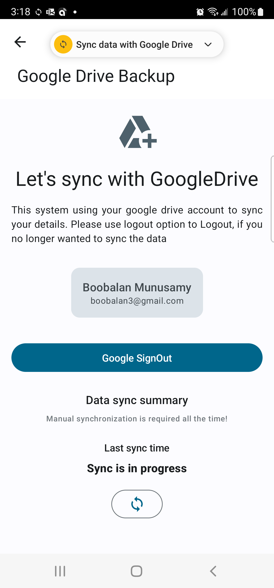

# GiftRegister

Android app that allows you to create a different event like engagement, marriage, birthday, etc., and to record the list of gifts you received for each event from the guest. You may need this information to remember what your friend gifted to you so you can give it back to their special occasion.

Thou, we understand that gifts are always a special way of showing love to your loved one and have never been counted in return. However, you may want to show your love in return with another special gift too. This app will record those specific gifts in the form of photos and numbers that shows the summary of it

# List of framework used

This applicaiton is build with most advance features available in the android like Jetpack compose with kotlin framework. Here are the few notable framework

1. Jetpack compose
2. Kotlin
3. Hilt Android
4. Navigation Framework
5. Material3
6. Lottie
7. Timber
8. Crypto for Encrypted Shared Preferences
9. Google Drive
10. Accompanist for permission, pager

# Dependencies
To run this application you need to enable Google Drive api & firebase configuration for analytics , crashlytics

1. To enable Google drive api, follow the configuration details ![Google Drive Api Integration Guide] (https://www.youtube.com/watch?v=vL62JcPsN2Q) 
in . 
2. Visit ![Firebase Console] (https://console.firebase.google.com/) to register your app in Firebase and download the configuration and place inti app root folder

# Screenshots

